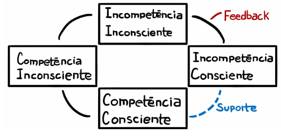

# Princípios de liderança

Esse markdown foi desenhado como um compilado do meu processo de desenvolvimento de liderança de pessoas. Diferente de um artigo, ele é um documento evolutivo e iterativo. O objetivo é compartilhar os princípios e ferramentas principais em uma liderança técnica que possam ajudar a mais pessoas terem a experiência de liderança.

Agradeço a ideia vinda do [Kamil Sindi](https://github.com/ksindi/managers-playbook) e incrementada como todo apoio e Material da [a.karta](https://akarta.com.br/) e outras referências que serão mantidas como link.

# Sumário
- [Princípios de liderança](#princ-pios-de-lideran-a)
- [Sumário](#sumário)
- [Time](#time)
- [O papel e características do líder neste time](#o-papel-e-características-do-líder-neste-time)
- [Gerenciamento Lean](#gerenciamento-lean)
  * [Princípio do baixo acoplamento](#princípio-do-baixo-acoplamento)
  * [Principio da alta iteração e pequenas entregas](#princípio-da-alta-itera--o-e-pequenas-entregas)
  * [Princípio da automação](#princípio-da-automação)
  * [Princípio da visibilidade](#princípio-da-visibilidade)
  * [Princípio da diversidade](#princípio-da-diversidade)

<!-- <small><i><a href='http://ecotrust-canada.github.io/markdown-toc/'>Table of contents generated with markdown-toc</a></i></small> -->

# Time

> “In teams which scored highly on architectural capabilities, little communication is required between delivery teams to get their work done.[...] In other words, architecture and teams are loosely coupled. To enable this, we must also ensure delivery teams are cross-functional, with all the skills necessary to design, develop, test, deploy, and operate the system on the same team.”
> > *Jez Humble; Nicole Forsgren; Gene Kim - Accelerate*

Um time é uma célula auto-suficiente, geralmente cross-functional e com o mínimo de interfaces composta por diversos papéis e que respeite a regra do [Two Pizzas Team](https://buffer.com/resources/small-teams-why-startups-often-win-against-google-and-facebook-the-science-behind-why-smaller-teams-get-more-done/) (o tamanho do time no deve superar o que duas pizzas são capazes de alimentar em uma noite escura de inverno) onde todos são autônomos focados em um [problema customer facing](https://kislayverma.com/organizations/independence-autonomy-and-too-many-small-teams/)

# O papel e características do líder neste time

O lider de pessoas geralmente é a figura que representa a empresa para o time. Sendo assim, é perceptível que as pessoas gostam de ver a conexão do seu trabalho em impactos positivos para os clientes e, consequentemente, alinhando-se ao propósito da empresa. Isso torna possível uma melhoria na qualidade da entrega do Software e Performance organizacional. 

Apesar de variar de empresa para empresa, no cenário de Desenvolvimento de Software, o líder é aquele que tem a responsabilidade de:
* Respeitar a individualidade de cada pessoa, praticando frequentemente escuta ativa
* Encontrar aprendizado das falhas ao invés de culpados
* Comunicar um forte senso de propósito e elevar a barra do time, investindo no desenvolvimento das pessoas dando tempo, espaço e recurso para experimentar e aprender
* Ser um facilitador, um meio de campo, entre as diferentes forças que interagem em um time

E para isso, segundo o Accelerate, ele pode ter algumas características como:
* **Visão**: Entendimento claro onde estamos e onde devemos estar em um futuro factível (6 meses? 5 anos? Vai do contexto) 
* **Comunicação inspiracional**: Comunica inspirando e motivando, mesmo em cenários incertos.
* **Desafiar intelectualmente**: Incentiva ao time pensar sobre o problema de formas diferentes.
* **Suporte/Apoio**: Demonstra cuidado e consideração pelas pessoas e seus sentimentos
* **Reconhecimento pessoal**: Reconhece o cumprimento de metas e melhorias na qualidade do trabalho; elogia pessoalmente.

Os pontos acima são competências propostas pelos materiais e experiências. No entanto, um trabalho super importante de uma liderança é lidar com pessoas, o que não é uma ciência exata.

# Gerenciamento Lean

O desenvolvimento de software é algo que evolui muito rapidamente no tempo. Garantir que o time esteja sendo o mais produtivo possível não é uma tarefa fácil no dia-a-dia onde o ambiente de incertezas e agilidade caminham juntos. Abaixo tentarei resumir alguns princípios capazes de nortear esta caminhada com base em algumas pesquisas (e muito influenciado pelo Accelerate)

## Princípio do baixo acoplamento

Comunicação é uma das maiores dificuldades em times ágeis de software, sendo assim: pouca comunicação é algo que facilita a agilidade.

> In teams which scored highly on architectural capabilities, little communication is required between delivery teams to get their work done. [Also,] the architecture of the system is designed to enable teams to test, deploy, and change their systems without dependencies on other teams.
> [Because of that,] high-performing group [...] can do most of our testing without requiring an integrated environment. We can and do deploy or release our application independently of other applications/ services it depends on.
> > *Jez Humble; Nicole Forsgren; Gene Kim - Accelerate*

Em outras palavras, reduzir a fricção da comunicação torna o time mais produtivo. E isso tem um efeito não linear como é ilustrado nessa famosa imagem de quanto mais pessoas, menos produtivo somos devido ao esforço de alinhamento entre todos os pontos:


> > *Retirado de [Dell & Endeavor: Eficiência para times de alto crescimento](https://www.dell.com/learn/br/pt/brbsdt1/campaigns/como-combater-os-ladroes-de-tempo)*

Para isso funcionar, pela [Lei de Conway](https://en.wikipedia.org/wiki/Conway%27s_law), não só a empresa deve reduzir comunicação mas a arquitetura do sistema deve ser orientada a desacoplamentos e contextos bem delimitados (bounded countexts).

> The goal is for your architecture to support the ability of teams to get their work done— from design through to deployment— without requiring high-bandwidth communication between teams. [...] Use of bounded contexts and APIs as a way to decouple large domains into smaller, more loosely coupled units, and the use of test doubles and virtualization as a way to test services or components in isolation.
> > *Jez Humble; Nicole Forsgren; Gene Kim - Accelerate*

E um caminho bem interssante que estou vendo no mercado é não existir mais aqueles times de "Operação", "Design", "Arquitetura", etc. No final, o time tem que ser autônomo, não é? Sendo assim, criar um time como todas estes papéis dentro do próprio time pode ser uma abordagem para incrementar a agilidade:

> Specialized roles create efficiencies within each segment while potentially creating inefficiencies across the entire life cycle.
> > *[Netflix Technology Blog - Full Cycle Developers at Netflix — Operate What You Build](https://netflixtechblog.com/full-cycle-developers-at-netflix-a08c31f83249)*

> ensure delivery teams are cross-functional, with all the skills necessary to design, develop, test, deploy, and operate the system on the same team.
> > *Jez Humble; Nicole Forsgren; Gene Kim - Accelerate*

## Princípio da alta iteração e pequenas entregas 
**(para mais interação com clientes)** 

Uma crítica clássica ao [modelo cascata](https://pt.wikipedia.org/wiki/Modelo_em_cascata) é justamente ele não permitir pequenos batches de entrega com o intuito de o cliente sentir progresso e conseguir ajudar no incremento do produto. Sendo assim, o segundo princípio vem com a mensagem: o time já fez entrega em produção hoje?

> Working in small batches enables short lead times and faster feedback loops.
> > *Jez Humble; Nicole Forsgren; Gene Kim - Accelerate*

A necessidade disso é simples: quanto mais iteração, mais fácil a validação (ou não) de um usuário final e mais claro o sentimento de dever cumprido dentro do time:

> [Product] actively and regularly seek customer feedback and incorporate this feedback into the design of their products. [...] 

> Our key hypothesis in asking these questions was that teams implementing continuous delivery practices and taking an experimental approach to product development will build better products, and will also feel more connected to the rest of their organization. This, in turn, creates a virtuous cycle: by creating higher levels of software delivery performance, we increase the rate at which teams can validate their ideas, creating higher levels of job satisfaction and organizational performance.
> > *Jez Humble; Nicole Forsgren; Gene Kim - Accelerate*

Além do aspecto de iteração, tem uma questão técnica também: Em geral, o dia-a-dia do desenvolvimento é lidar com variáveis complexas e abstratas. Sendo assim, reduzir a chance do erro através de pequenas e constantes melhorias fazem com que a busca pela solução fique mais próxima da ideal.

> Even though working in small chunks adds some overhead, it reaps enormous rewards by allowing us to avoid work that delivers zero or negative value for our organizations.
> We found that external approvals were negatively correlated with lead time, deployment frequency, and restore time, and had no correlation with change fail rate.
> > *Jez Humble; Nicole Forsgren; Gene Kim - Accelerate*

Agora: quão grande ou quão pequena deve ser a entrega? Na prática, alterar os valores de [WIP Limit e manter consistência no throughput](https://medium.com/rd-shipit/m%C3%A9tricas-em-times-%C3%A1geis-as-3-m%C3%A9tricas-fundamentais-que-voc%C3%AA-precisa-saber-e-dominar-816ffb6a53c5) para que eles sejam saudáveis para o time é uma fórmula que varia de time para a time mas uma boa prática a ser seguida.

Ao final, é importante entender que durante o processo de desenvolvimento de software, limitações técnicas podem surgir e ninguém melhor que o time técnico para encontrar soluções, sendo eles parte muito importante da entrega de valor para o cliente final.

> One of the points of Agile development is to seek input from customers throughout the development process, including early stages.

> Development teams have the authority to create and change specifications as part of the development process without requiring approval.
> > *Jez Humble; Nicole Forsgren; Gene Kim - Accelerate*

## Princípio da automação
 
Processos são comuns para garantir qualidade e segurança, como a ideia é fazer diversos deploys por dia (vide princípio da alta iteração), investir em automação e a cultura do DevOps, segundo o Accelerate ajuda a garantir o respeito a este processo com o intuito de aumento de, entre outras coisas, qualidade.

> Automated unit and acceptance tests should be run against every commit to version control to give developers fast feedback on their changes. [...] Developers should be able to run all automated tests on their workstations [...and] no one should be saying they are “done” with any work until all relevant automated tests have been written and are passing.
> changes should only be applied to production using a fully automated process that forms part of a deployment pipeline. That is, no changes should be able to be made to production unless they have been committed to version control, validated by the standard build and test process, and then deployed through an automated process triggered through a deployment pipeline.
> > *Jez Humble; Nicole Forsgren; Gene Kim - Accelerate*

Além de qualidade, o deploy deve ser algo simples, não um evento que gera calafrios ou necessitam ser feitos em horários extras. Isso reduz inclusive a reduzir burnout!

> when teams practice CD, deployment to production is not an enormous, big-bang event— it’s something that can be done during normal business hours as a part of regular daily work. [...Also,] they help to decrease deployment pain and team burnout.
> > *Jez Humble; Nicole Forsgren; Gene Kim - Accelerate*

O objetivo é que qualquer processo ou burocracia repetitiva dentro de uma organização (como deploy, documentação, etc) possa ser visualizado como uma oportunidade de automação. Isso torna o trabalho mais sustentável e produtivo para as próprias pessoas:

> Investments in technology are also investments in people, and these investments will make our technology process more sustainable
> > *Jez Humble; Nicole Forsgren; Gene Kim - Accelerate*

## Princípio da visibilidade 

Seu serviço está de pé? Quantos requests ele está recebendo? Qual throughput do seu time no último mês?

Estas são perguntas muito comuns que managers recebem. No entanto, qualquer pessoa do time deveria ser capaz de entender e responder estas perguntas no intuito de melhorá-las.

> Managers should make performance metrics visible and take pains to align these with organizational goals, and should delegate more authority to their employees.
>> *Jez Humble; Nicole Forsgren; Gene Kim - Accelerate*

Este princípio ajuda o próprio time a se regular e verificar os resultados das suas alterações. 

[FALTA MAIS REFERENCIA AQUI]

## Princípio da diversidade

> Kintsugi ("emenda de ouro") é uma antiga arte japonesa que consiste em reparar cerâmica quebrada com pó de ouro ou algum material com brilho, tornando-a uma peça única pois suas rachadoras beiram o impossível de se reproduzir. Como resultado, a peça restaurada se torna muito mais valiosa.
>> [Kintsugi (Wikipedia)](https://en.wikipedia.org/wiki/Kintsugi)

Como metáfora (e até filosofia!), cada pessoa traz consigo uma história e diversas "rachaduras de ouro" que as fazem únicas e acrescentam uma visão diferente dentro do time. Pessoas de senioridade, cor, sexo, etnias diferentes dentro do time significa objetivamente ter mais formas de resolver problemas e isso é lindo pois as rachaduras que uma pessoa traz a um time ou uma empresa transforma o ambiente, acrescentando novos significados e aumentando a performance da organização

> Diversity matters. Research shows that teams with more diversity with regard to gender or underrepresented minorities are smarter (Rock and Grant 2016), achieve better team performance (Deloitte 2013), and achieve better business outcomes [...] It is also important to note that diversity is not enough. Teams and organizations must also be inclusive.
>> *Jez Humble; Nicole Forsgren; Gene Kim - Accelerate*

E não basta somente ter no time, mas como líder, prover mecanismos onde estas pessoas possam se sentir confiantes em se expressar e crescer através das conexões dentro e fora do time:

> Creating connections among followers is one of the most important tasks for leaders.
>> [Management 3.0](https://management30.com/energize-people/individuals-interactions/)


<!--
WIP WIP WIP WIP WIP WIP WIP WIP WIP WIP WIP WIP WIP WIP WIP WIP WIP 


# Cerimônias e reuniões

## Daily

**Objetivo:** 

**Premissa:** 

**Duração:** 

##  Retrospectiva

**Objetivo:** 

**Premissa:** 

**Duração:** 

**Dinâmicas:** 
* [Moving Motivators](https://management30.com/practice/moving-motivators/)

##  Planning

**Objetivo:** 

**Premissa:** 

**Duração:** 

## One on Ones

**Objetivo:** Esta é a cerimônia mais importante na construção de um relacionamento líder-liderado. É aqui que acompanhamos:
- O passado: Feedback sobre comportamentos e entregas
- O presente: Performance, clima e relacionamento com a equipe
- O futuro: Tour of duty e alinhamento de expectativas

Este é o momento que deve ser individualizado: o que funciona para uma pessoa pode não funcionar para outra (ou até mesmo para a mesma pessoa em um tempo diferente)

**Premissa:** Ele tem como premissa as [4 fases do aprendizado](https://focuslife.com.br/4-fases-do-aprendizado-pnl/)



**Duração:** Ela pode variar de pessoa para pessoa mas geralmente é uma reunião de 30 a 40 minutos. Onde segue-se geralmente esta estrutura:
1. Abrir espaço para deixar o liderado trazer o tópico principal (Começar sempre com: E aí, como está sendo a semana?)
2. Trazer um dos tópicos abaixo, se tiver tempo.
3. Finalizar a 1:1 com algo "O que podemos fazer para evoluirmos no que falamos hoje? Vamos chegar a uma solução em conjunto?"

### 1:1s de futuro profissional
* Como você vê o seu futuro profissional? O que você acredita que a empresa já conseguiu te ajudar neste sentido? Como a empresa consegue ajudar nas conquistas que você almeja? Como posso ajudar?
* Você sente que está progredindo nos seus grandes objetivos aqui?
* Seu trabalho é o que você esperava quando aceitou? Como você descreveria o ambiente de trabalho no time?

### 1:1s de time
* Hoje você tem um ponto focal no time? Alguém que você admira? Com quem você tem mais dificuldade em trabalhar? Por quê?
* Dos valores da empresa, você acredita que estamos falhando em algum?

### 1:1s de projeto
* Como esse projeto está indo? O que podemos fazer para fazermos melhor? Algo te travando? Algo não está claro? Posso ajudar em algo
* Dentro deste projeto, qual seria o resultado ideal? E como podemos alcançá-lo na sua opinião?

### 1:1s sobre feedback sobre o trabalho como lider
* Como lider, o que não estou fazendo para ajudar o seu dia-a-dia?
* Como lider, o que estou fazendo para ajudar o seu dia-a-dia?
* O que não deveria estar fazendo e estou?

### Primeiras 1:1s com meus líderes

LER https://larahogan.me/blog/first-one-on-one-questions/

Assim como os liderados, seus líderes precisam ter clareza sobre seu trabalho e você precisa ter clareza das expectativas deles

* O que você espera do time no final do quarter? Quais são os critérios de sucesso (padrão de desempenho, entregas, métricas, iniciativas) que devem avaliar minha performance?
* Qual é o seu maior medo sobre nossa temática?
* Quais desafios da área meu time é diretamente responsável?
* Como vemos minha contribuição para esse momento do time/área/negócio?

## Alinhamento de Objetivos (Goal Setting e Tour of Duty)

> "Uma vida com propósito é aquela em que eu entenda as razões pelas quais faço o que faço e pelas quais claramente deixo de fazer o que não faço." 

> "Até algum tempo atrás, a vida era muito menos complexa e a intenção principal era sobreviver. Isto é, obter recursos para montar uma família e ter um patrimônio que se pudesse deixar de herança. Como a sociedade hoje é mais focada no indivíduo, a ideia de propósito está marcada por um conceito que já existiu e voltou com força: o da realização."

*["Por que fazemos o que fazemos?" - Mario Sergio Cortella](https://www.amazon.com/Por-que-fazemos-Portuguese-ebook/dp/B01JT2I3DA/)*

Alinhar objetivos é essencial para uma boa comunicação líder-liderado. A importância de chegar a objetivos comuns do time e pessoais é que eles deixam clara a sua relação com as pessoas do time e como (Key Results) devem ser alcançados.

PESQUISAR UM POUCO MAIS SOBRE OKRs

Idealmente trabalha-se com 2 tipos de Goals para um determinado tempo (Semestre/Trimestre):
1. Objetivo de entrega ou do time: Como um time, precisamos estar alinhados com os objetivos da empresa. Neste sentido, os objetivos aqui explorados são alinhados para que consigamos atingir um marco dentro da Organizaço e conseguir novos investimentos. 
2. Objetivo pessoal ou de desenvolvimento: Toda pessoa que está no grupo tem o interesse de se desenvolver

Os objetivos de time alinham somente que iremos passar de um ponto A para um ponto B.

```
A ...----|-----|-----|---- > B(performance)
```

Para uma organização continuar inovando. Esta passagem de fase muitas vezes não é suficiente. Fazer do mesmo jeito do que fazíamos ontem pode ser o primeiro passo para o fracasso. No entanto, alinhar as goals pessoais conseguem transformar a visão das pessoas, propondo e explorando novas soluções, transformando o tour de uma pessoa:

```

                    /-- > C,D(desenvolvimento)     ^
                   /                              | proximos 
                  /                               |
A----|-----|-----|---- > B(performance)            | tours
```

Para o desenvolvimento pessoal, existe um framework: 70/20/10 
* 70% do tempo na prática
* 20% do tempo com pessoas/mentores
* 10% do tempo em um estudo formal como livros ou cursos


PESQUISAR UM POUCO MAIS SOBRE TOUR OF DUTY

## Comemorações e Entrega

> "A coisa mais incrível de vencer não é a vitória em si. É poder contar, ensinar outras pessoas sobre como você fez, por que fez, de que maneira fez, com que considerações fez e o que levou em conta. São os valores que você pratica que contam."

*["Seja foda! - Caio Carneiro"](https://www.amazon.com.br/Seja-foda-Portuguese-Caio-Carneiro-ebook/dp/B079GZM3P5)*

# Motivação do time

> "Rotina não é monotonia, [...] a rotina consiste em uma série de procedimentos-padrão com os quais um processo completa. E esse nível de repetibilidade é o que torna a rotina mais adequada. [...] A monotonia é a morte da motivação. As pessoas [...] tentam alterar a situação quando veem o risco de monotonia”

*["Por que fazemos o que fazemos?" - Mario Sergio Cortella](https://www.amazon.com/Por-que-fazemos-Portuguese-ebook/dp/B01JT2I3DA/)*

> The most important characteristic of high-performing teams is that they are never satisfied: they always strive to get better.
*Jez Humble; Nicole Forsgren; Gene Kim - Accelerate*

Em rituais como 1:1 temos bastante uma visão da pessoa sobre suas motivações. No entanto, é importante enteder pessoas como um grupo.

ENTENDER QUE TODOS TEMOS INTERESSE DENTRO DO GRUPO

PODCAST DO NARUHODO

TEORIA DE GRUPO

Segurança Psicológica (fearless organization / Coragem Psicologica)- Fenômeno de Grupo. Oportunidade de enxergar no grupo que estou:
* Expressar
* Interagir
* Aprender
* Pertencer

"Nada melhor para desmotivar uma boa pessoa é tolerar uma ruim"

# Organização Pessoal

Uso de uma só agenda porque você é um só!

# Links e Livros

- Accelerate
- Meus artigos https://medium.com/@felipecdo/o-que-software-livre-ainda-tem-para-nos-ensinar-c0f3c5c330aa
-->
